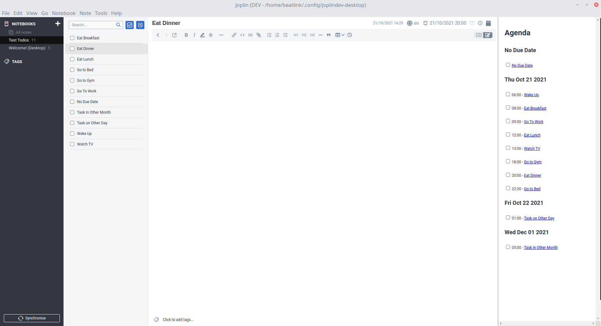
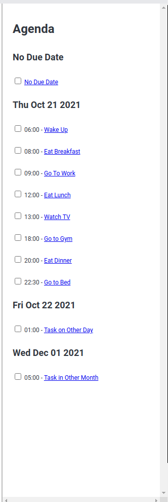

# Agenda

An agenda/calendar/schedule panel plugin for joplin that shows all uncompleted to-dos with a due date

## Screenshots
### Main Interface

### The Agenda Panel

## Todo
* Publish to repo
* Create post on forum

## Development
* Download Repo
* Run `npm install`
* Modify code in `/src`
* Update Metadata in `/src/manifest.json` and `/package.json`
* Build plugin with `npm run dist`
* Update the plugin framework with `npm run update`
* Publish using `npm publish`
